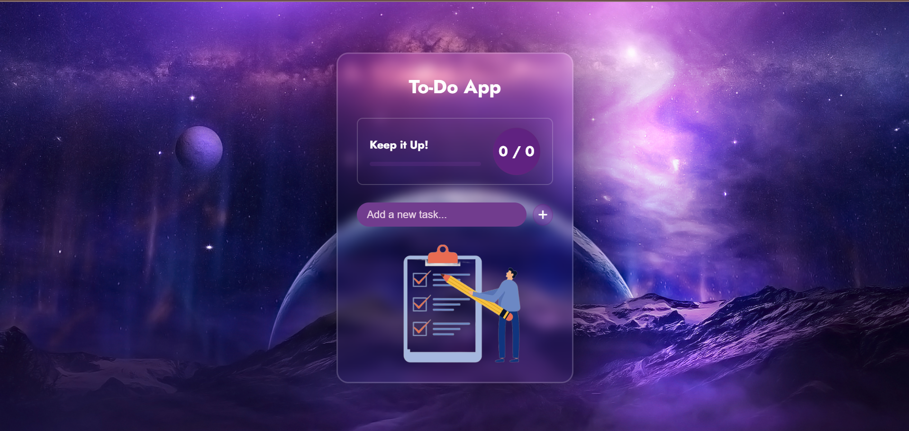

# 📝 To-Do List App

An interactive and responsive To-Do List web app built using **HTML, CSS, and JavaScript**. This app allows users to add, update, delete, and track tasks with real-time progress updates and fun confetti animations upon completion! 🎉

## 🚀 Features

- ✅ Add, edit, and delete tasks (CRUD functionality)
- 💾 Stores tasks in **Local Storage** (no data loss on refresh)
- 📊 Visual **progress bar** to track completed tasks
- 🎊 Confetti animation on task completion for better UX
- 📱 Fully responsive UI for all screen sizes

## 📸 Preview

 <!-- Replace with an actual screenshot path if available -->

## 🛠️ Tech Stack

- **HTML5**
- **CSS3**
- **JavaScript (ES6+)**
- **Local Storage API**

## 📂 Project Structure

```
To-Do-App/
│
├── index.html        # Main HTML file
├── style.css         # Styling
├── script.js         # Functionality (CRUD + animations + storage)
└── images/           # Icons or preview images (optional)
```

## 🌐 Live Demo

> [Click here to view the live project](https://poorvimathur22.github.io/To-Do-App/)

## 💡 How to Use

1. Clone the repository:
   ```
   git clone https://github.com/poorvimathur22/To-Do-App.git
   ```
2. Open `index.html` in your browser.

## 📌 Future Improvements

- Add categories/labels to tasks
- Drag-and-drop task reordering
- Dark mode toggle

## 🤝 Contributions

Contributions, issues, and feature requests are welcome!

## 📄 License

This project is open source and available under the [MIT License](LICENSE).
